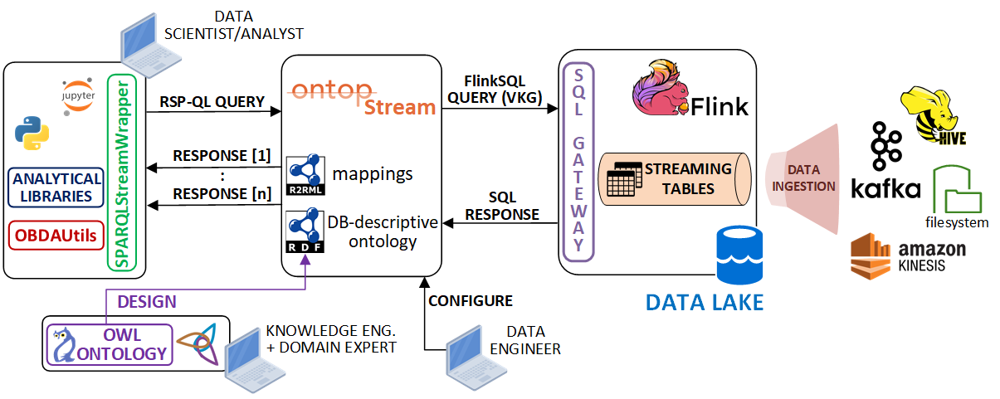

# OntopStream tutorial

## Overview



## Setup and Execution

### 1. Start Flink, Kafka and Jupyter

```
sudo docker-compose -f flink-kafka.yml up -d
```

### 2. Start the REST endpoint

Connectct to the `sql-client` remote terminal

```
sudo docker-compose -f flink-kafka.yml exec sql-client /opt/flink-sql-gateway-0.2-SNAPSHOT/bin/sql-gateway.sh --library /opt/sql-client/lib
```

__Note(1)__: keep the REST endpoint alive until you need the service (don't close the terminal window).

__Note(2)__: the JDBC driver mappings are persisted on the local file [sql-gateway-defaults.yaml](./flink/flink-sql-gateway-0.2-SNAPSHOT/conf/sql-gateway-defaults.yaml), which is automatically loaded on startup in the `sql-client` docker image.

### 3. Start the data generators

Open a new browser tab and go to the JupyterLab web UI in `http://<IP-ADDRESS>:80/lab?token=TEST` (if you're running the environment on your local machine `<IP-ADDRESS>` is `localhost`).

Run the data generato notebooks:
  - `dealer_1.ipynb`: data generator for the car dealer #1
  - `dealer_2.ipynb`: data generator for the car dealer #2

__Note__: keep the data generators running until the end of the tutorial.

### 4. Start OntopStream

Open a ___new terminal window___, then run the command:

```
sudo docker-compose -f ontop.yml up -d
```

The OntopStream instance will automatically load the configuration files (ontology, OBDA mappings, JDBC properties) stored in the `ontop/input` folder.

### 5. Start Jupyter

Go back to the JupyterLab environment.

Run the queries in the `OntopStream_demo.ipynb` notebook

### 5. Stop the demo environment (end of the demo...)

To close the Flink REST service endpoint, press `CTRL+C` and type `EXIT` to leave the terminal.

Then, you can terminate all the instances, using the following commands:

```
sudo docker-compose -f ontop.yml down

sudo docker-compose -f flink-kafka.yml down
```

## Additional Tools

### Main configuration files

- `flink` folder:
  - `sql-client-conf.yaml`: Flink tables metadata descriptions, used to persist the schema across several sessions
  - `flink-sql-gateway-0.2-SNAPSHOT/conf/sql-gateway-defaults.yaml`: REST enpoint tables metadata descriptions, exposed by the JDBC endpoint
- `ontop` folder:
  - `input` folder:
    - `.owl`: ontological concepts
    - `.obda`: RDF --> FlinkSQL mappings
    - `.properties`: JDBC endpoint connection settings
  - `jdbc` folder: OntopStream JDBC driver

### FlinkSQL CLI terminal (debug)

Flink's built-in shell to run FlinkSQL queries to compare with the stream of (relational) data in the streaming tables:

```
sudo docker-compose -f flink-kafka.yml exec sql-client ./sql-client.sh
```
