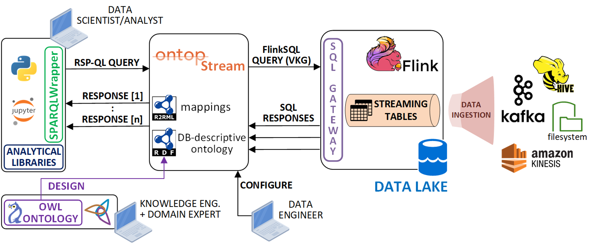
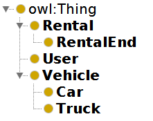
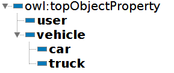
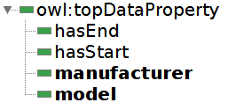

# OntopStream tutorial

In this tutorial, we will see how to design a Streaming Virtual Knowledge Graph (Streaming-VKG) specification, how to deploy it as a RSP-QL endpoint, how to integrate heterogenous streaming data coming from several Kafka topics.



## A) Tutorial setup

__Note:__ use `sudo <command>` if you need administrator privileges on UNIX systems...

### 1. Start Flink, Kafka and Jupyter

The following commands will start the streaming data infrastructure (Kafka and Flink), as well as the JupyterLab Environment

UNIX/Mac:
```
docker-compose -f flink-kafka-unix.yml up -d
```

Windows:
```
docker-compose -f flink-kafka-win.yml up -d
```

Next, ont the same terminal, you have also to start the Flink JDBC service (wait 30 seconds to leave Flink starting up):

```
docker exec -it sql-client /opt/flink-sql-gateway-0.2-SNAPSHOT/bin/sql-gateway.sh --library /opt/sql-client/lib
```

__Note(1)__: keep the JDBC endpoint alive until you need the service (don't close the terminal window).

__Note(2)__: the JDBC driver mappings are persisted on the local file [sql-gateway-defaults.yaml](./flink/flink-sql-gateway-0.2-SNAPSHOT/conf/sql-gateway-defaults.yaml), which is automatically loaded on startup in the `sql-client` docker image.

### 2. Start OntopStream

Open a ___new terminal window___, then run the command:

```
docker-compose -f ontop.yml up -d
```

The OntopStream instance will automatically load the configuration files (ontology, OBDA mappings, JDBC properties) from the `ontop/input` folder.

### 3. Open JupyterLab

Open a new browser tab and go to the JupyterLab web UI in [`http://<IP-ADDRESS>:8888/lab?token=TEST`](localhost:8888)

If you're running the environment on your local machine `<IP-ADDRESS>` is `localhost`


## B) Tutorial

A car rental company has recently decided to __unify the information systems__ of __two branches__ using ontology-based data access techniques.

They want to keep their data queryable in real-time using python notebooks. The rental company wants to make the integration process scalable, so that if the integration is successfull the process can be applied to all its branches.

The company management has decided to adopt OntopStream for the integration.

## Kafka

Note: the field `ts` represents ___non-decreasing timestamps___(format ``%Y-%m-%d %H:%M:%S`) generated in real-time when the rental entry is published in a Kafka topic.

### Branch A

The __Branch A__ stores the car and truck rentals data in two separate Kafka topics:

__DEALER1_CARS__

| user|rid|manufacturer|model|plate|status|ts|
|:---|:----:|:----:|:----:|:----:|:----:|---:|
|Molly Davis|1|Fiat|Panda|FJ7PUJJ|START|t1|
|Laura Baker|2|Tesla|Model S|JFGJ60A|START|t2|
|William Diaz|3|Fiat|Tipo|FGL1X62|START|t5|
|Molly Davis|1|Fiat|Panda|FJ7PUJJ|END|t7|
|William Diaz|3|Fiat|Tipo|FGL1X62|END|t7|

__DEALER1_TRUCKS__

| user|rid|manufacturer|model|plate|status|
| :--- |:----:|:----:|:----:|:----:| ---: |
|Laura Baker|1|Iveco|Daily|HHST532|START|t1|
|Wayne Flower|2|Fiat|Ducato|DM89JKD|START|t3|
|Richard Tillman|5|Fiat|Ducato|JSDJFI3|START|t6|
|Richard Tillman|5|Fiat|Ducato|JSDJFI3|END|t9|
|Wayne Flower|2|Fiat|Ducato|DM89JKD|END|t10|

Each kafka message represents a rental update according to its `status`:
- `START` messages are used for new rentals
- `END` messages are used when the resntal is over (the vehicle is available for a new rental)

### Branch B

The __Branch B__ stores the car and truck rentals data in a single Kafka topics, but uses another additional topic to keep track of the users data:

__DEALER2_VEHICLES__

|userID|rid|type|manufacturer|model|plate|status|ts|
|:---|:----:|:----:|:----:|:----:|:----:|:----:|---:|
|3|1|Car|Audi|A3|DFU4HJF|START|t1|
|4|2|Car|Mercedes|Classe C|784JD93|START|t2|
|3|7|Truck|Mercedes|Vito|KD94KDS|START|t3|
|3|1|Car|Audi|A3|DFU4HJF|END|t4|
|6|8|Truck|Mercedes|Vito|012JKD0|START|t5|
|3|7|Truck|Mercedes|Vito|KD94KDS|END|t6|

Each kafka message represents a rental update according to its `status`:
- `START` messages are used for new rentals
- `END` messages are used when the resntal is over (the vehicle is available for a new rental)


__DEALER2_USERS__

|userID|name|
| :---|---: |
|1|Douglas Fitch|
|2|William Diaz|
|3|Kevin Rodriguez|
|4|Catherine Crandell|
|5|Richard Tillman|

User details are stored in a separate kafka topic. A user is added to the topic when it is a first time renter.

### Topics data generators

Run the following data generator notebooks from Jupyterlab:
  - `dealer_1.ipynb`: data generator for the car dealer #1
  - `dealer_2.ipynb`: data generator for the car dealer #2

__Note(1)__: keep the data generators running until the end of the tutorial.

__Note(2)__: If you need to restart the data generators, you can delete the topics and their data using the `TOPICS_DELETE.ipynb` notebook (folder `data_generators`), and then re-run the data generator notebooks.


## Streaming-VKG implementation

Note that, the Flink and OntopStream configurations have been already take in place.

To apply a configuration change to Flink or OntopStream, you need to stop and restart the docker environment.

### Streaming tables design (Flink)

To allow OntopStream to access the topics data, we need to design the ingestion into the Flink streaming tables, using the Kafka connector of the Table & SQL library.

The data acquisition in Flink is automated, as we only need to define the table schema and properties for the connection to the related Kafka topic. Please refer to the [sql-client-conf.yaml](./flink/sql-client-conf.yaml) file in the `flink` folder for the .

Streaming tables can be queried with FlinkSQL continuous queries, recorded in Flink. The topics data is ingested only when a query needs to access the Flink tables' data.

For example, the topic messages of `DEALER2_VEHICLES` and `DEALER2_USERS`can be ingested in the following Flink tables.

```yaml
- name: D2_VEHICLES
  type: source
  update-mode: append
  schema:
  - name: userID
    type: BIGINT
  - name: rid
    type: BIGINT
  - name: type
    type: STRING
  - name: manufacturer
    type: STRING
  - name: model
    type: STRING
  - name: plate
    type: STRING
  - name: status
    type: STRING
  - name: ts
    type: STRING
  - name: parsed_timestamp
    type: TIMESTAMP
    rowtime:
      timestamps:
        type: "from-field"
        from: "ts"
      watermarks:
        type: "periodic-bounded"
        delay: "5"
  connector:
    property-version: 1
    type: kafka
    version: universal
    topic: DEALER2_VEHICLES
    startup-mode: earliest-offset
    properties:
    - key: bootstrap.servers
      value: kafka:9092
  format:
    property-version: 1
    type: json
    schema: "ROW(userID BIGINT, rid BIGINT, type STRING, manufacturer STRING, model STRING, plate STRING, status STRING, ts STRING)"

- name: D2_USERS
  type: source
  update-mode: append
  schema:
  - name: userID
    type: BIGINT
  - name: name
    type: STRING
  connector:
    property-version: 1
    type: kafka
    version: universal
    topic: DEALER2_USERS
    startup-mode: earliest-offset
    properties:
    - key: bootstrap.servers
      value: kafka:9092
  format:
    property-version: 1
    type: json
    schema: "ROW(userID BIGINT, name STRING)"
```

Then, the Flink tables are exposed through a JDBC endpoint using the flink-sql-gateway of Ververica, configurable using the same tables descriptions described above.

The gateway configuration file is [sql-gateway-defaults.yaml](.//flink/flink-sql-gateway-0.2-SNAPSHOT/conf/sql-gateway-defaults.yaml)

### Streaming-VKG mappings (OntopStream)

#### Ontology design

Next, we need to design an ontology (with the help of [Protege](https://protege.stanford.edu/)) to integrate the data coming from the two rental branches. The ontology described below can be found in the `/ontop/input` folder.

Let's start with the __Classes__ definitions.

The concepts of `Car` and `Truck` are expressed as subclasses of `Vehicle`, so that it should be possible later to query only `Cars`, `Trucks`, or both (`Vehicles`).

Likewise, `RentalEnd` is a specialization of `Rental` that can be used to identify all the rentals which have already been ended (there is a kafka message with `status = End`).



__Object Properties__ are used to connect Entities with other entites.

They also help to ease the mapping process and express implicit domain/ranges on Class instances (entites)

For example:
 - the `user` property range is `User`
 - the `vehicle` property range is `Vehicle` (superclass of `Car` and `Truck`)



Finaly, __Data Properties__ are used to expose the kafka messages entries such as the vehicle details (manufacturer, model, ...)



#### Streaming-VKG mappings design

Mappings connects the ontology terms to data streams (Kafka messages in Flink).

Given as input an ontology and a set of mappings between RDF statements and FlinkSQL queries, OntopStream can answer RSP-QL queries with RDF semantically enriched responses based on both ontological concepts and streaming data retrieved through FlinkSQL Streaming VKG queries registered in Flink.

A Streaming VKG mapping consists of three parameters:

- `MappingID`: a name to identify the mapping
- `Source`: a FlinkSQL query for the data extraction from the Flink streaming tables
- `Target`: one or more RDF statements corresponding to the graph generated by the single entry obtained from the data extracted with the Source query executed by Flink (the graph enclosed parameters corresponds to tuple's fileds coming as response from a FlinkSQL query). The statements refer to the classes and properties contained in the reference ontology described above.

##### Branch A rentals

We can say if the rented vehicle is a car or a truck from the source table (`D1_TRUCKS` and `D1_CARS`).

To identify whether a Kafka message ingested into Flink refers to a started or ended lease, we can use the `WHERE` clause in the FlinkSQL source query to filter by the` status` field:
- `WHERE status='START'` retrieves the starting rentals stream of messages
- `WHERE status='END'` retrieves the ended rentals stream of messages

In the following, are presented the mappings for the __starting rentals__:

```
mappingId    DEALER1-CarRental
target        :D1_C{rid} a :Rental; :user :{user}; :hasStart {ts}; :car :{plate}. :{plate} a :Car; :manufacturer {manufacturer}; :model {model}.
source        SELECT rid,user,ts,plate,manufacturer,model FROM D1_CARS WHERE status='START'

mappingId    DEALER1-TruckRental
target        :D1_T{rid} a :Rental; :user :{user}; :hasStart {ts}; :truck :{plate}. :{plate} a :Truck; :manufacturer {manufacturer}; :model {model}.
source        SELECT rid,user,ts,plate,manufacturer,model FROM D1_TRUCKS WHERE status='START'
```

To map __ended rentals__, we can use the `RentalEnd` subclass of `Rental`, to ease some notebook queries. Moreover, we don't need to map again user and vehicle details (model, brand,...) to the car entity, because we assume that every rental end event is always preceded by starting reantal event.

```
mappingId    DEALER1-CarRentalEnd
target        :D1_C{rid} a :RentalEnd; :hasEnd {ts}; :car :{plate}.
source        SELECT rid,ts,plate FROM D1_CARS WHERE status='END'

mappingId    DEALER1-TruckRentalEnd
target        :D1_T{rid} a :RentalEnd; :hasEnd {ts}; :truck :{plate}.
source        SELECT rid,ts,plate FROM D1_TRUCKS WHERE status='END'
```

##### Branch B rentals

The second branch provides a single Kafka topic containing messages about both Car and Truck rentals.

We can use two separate mappings for the two kind of vehicles and identify them using the `WHERE type='Car' `WHERE type='Truck' filtering condition in the source query.

In order to expose the same information of Branch A, we need to combine the user data (name) from the `D2_USERS` Flink Table with the `D2_VEHICLES` data. This can be dome using a `JOIN` over the `userID` field in the FlinkSQL source queries.

In the following, are presented the mappings for the __starting rentals__:

```
mappingId	DEALER2-CarRental
target		:D2_{rid} a :Rental; :user :{name}; :hasStart {ts}; :car :{plate}. :{plate} a :Car; :manufacturer {manufacturer}; :model {model}.
source		SELECT rid,name,ts,plate,manufacturer,model FROM D2_VEHICLES,D2_USERS WHERE D2_VEHICLES.userID=D2_USERS.userID AND type='Car' AND status='START'

mappingId	DEALER2-TruckRental
target		:D2_{rid} a :Rental; :user :{name}; :hasStart {ts}; :truck :{plate}. :{plate} a :Truck; :manufacturer {manufacturer}; :model {model}.
source		SELECT rid,name,ts,plate,manufacturer,model FROM D2_VEHICLES,D2_USERS WHERE D2_VEHICLES.userID=D2_USERS.userID AND type='Truck' AND status='START'
```

To map __ended rentals__ we don't actually need to specify if a vehicle is a car or a truck, because the iformation is available from the starting rental mappings. We can just use the data property `vehicle`, whose property range is `Vehicle` (superclass of `Car` and `Trucks`).

```
mappingId    DEALER2-RentalEnd
target        :D2_{rid} a :RentalEnd; :hasEnd {ts}; :vehicle :{plate}.
source        SELECT rid,ts,plate FROM D2_VEHICLES,D2_USERS WHERE D2_VEHICLES.userID=D2_USERS.userID AND status='END'
```

##### Mapping file for OntopStream

In the following, is presented the `.obda` mapping file for Branch A and B used by OntopStream in this tutorial. It is stored in the `/ontop/input` folder

```
[PrefixDeclaration]
:		http://www.semanticweb.org/car-rental#
rdf:		http://www.w3.org/1999/02/22-rdf-syntax-ns#
xsd:		http://www.w3.org/2001/XMLSchema#

[MappingDeclaration] @collection [[
mappingId	DEALER1-CarRental
target		:D1_C{rid} a :Rental; :user :{user}; :hasStart {ts}; :car :{plate}. :{plate} a :Car; :manufacturer {manufacturer}; :model {model}.
source		SELECT rid,user,ts,plate,manufacturer,model FROM D1_CARS WHERE status='START'

mappingId	DEALER1-TruckRental
target		:D1_T{rid} a :Rental; :user :{user}; :hasStart {ts}; :truck :{plate}. :{plate} a :Truck; :manufacturer {manufacturer}; :model {model}.
source		SELECT rid,user,ts,plate,manufacturer,model FROM D1_TRUCKS WHERE status='START'

mappingId	DEALER1-CarRentalEnd
target		:D1_C{rid} a :RentalEnd; :hasEnd {ts}; :car :{plate}.
source		SELECT rid,ts,plate FROM D1_CARS WHERE status='END'

mappingId	DEALER1-TruckRentalEnd
target		:D1_T{rid} a :RentalEnd; :hasEnd {ts}; :truck :{plate}.
source		SELECT rid,ts,plate FROM D1_TRUCKS WHERE status='END'

mappingId	DEALER2-CarRental
target		:D2_{rid} a :Rental; :user :{name}; :hasStart {ts}; :car :{plate}. :{plate} a :Car; :manufacturer {manufacturer}; :model {model}.
source		SELECT rid,name,ts,plate,manufacturer,model FROM D2_VEHICLES,D2_USERS WHERE D2_VEHICLES.userID=D2_USERS.userID AND type='Car' AND status='START'

mappingId	DEALER2-TruckRental
target		:D2_{rid} a :Rental; :user :{name}; :hasStart {ts}; :truck :{plate}. :{plate} a :Truck; :manufacturer {manufacturer}; :model {model}.
source		SELECT rid,name,ts,plate,manufacturer,model FROM D2_VEHICLES,D2_USERS WHERE D2_VEHICLES.userID=D2_USERS.userID AND type='Truck' AND status='START'

mappingId	DEALER2-RentalEnd
target		:D2_{rid} a :RentalEnd; :hasEnd {ts}; :vehicle :{plate}.
source		SELECT rid,ts,plate FROM D2_VEHICLES,D2_USERS WHERE D2_VEHICLES.userID=D2_USERS.userID AND status='END'
]]
```

### Querying the data (RSP-QL queries)

OntopStream allows the itegration of the data coming from the two branches A and B.

Hence, we can use a Jupyter notebook and the SPARQLStreamWrapper library to register SPARQL continuous queries (RSP-QL) in OntopStream and obtain real-time answers based Kafka topic's messages.

For example, we can use the following code to get the rentals of Porsche and Tesla cars from both the branches:

```python
from SPARQLStreamWrapper import SPARQLStreamWrapper, TSV

sparql = SPARQLStreamWrapper("http://ontop:8080/sparql")
sparql.setQuery("""
PREFIX : <http://www.semanticweb.org/car-rental#>

SELECT ?user ?car ?man ?model ?start

WHERE {
    ?car a :Car; :model ?model; :manufacturer ?man.
    ?rent a :Rental; :car ?car.
    ?rent :hasStart ?start; :user ?user.
    FILTER(?man="Tesla" || ?man="Porsche")
}
""")

sparql.addParameter("streaming-mode","single-element")
sparql.setReturnFormat(TSV)

results=sparql.query()

try:
    for result in results:
        data = result.getRawResponse().decode('utf8')     # Get response from OntopStream
        data = data.replace("%20"," ")                    # Clean IDs
        print(data)
except KeyboardInterrupt:
    sparql.endQuery()
    print("Ended by user")
```

The company has rented both Mercedes cars and trucks during its operations. We can exploit reasoning over the ontological layer in OntopStream (the superclass `Vehicle` of `Car` and `Truck`) to get all the Mercedes vehicles rented in both the categories:


```python
from SPARQLStreamWrapper import SPARQLStreamWrapper, CSV
import os

sparql = SPARQLStreamWrapper("http://ontop:8080/sparql")
sparql.setQuery("""
PREFIX : <http://www.semanticweb.org/car-rental#>

SELECT ?user ?plate ?model ?start

WHERE {
    ?plate a :Vehicle; :manufacturer ?man; :model ?model.
    ?rent a :Rental; :vehicle ?plate.
    ?rent :hasStart ?start; :user ?user.
    FILTER(?man="Mercedes")
}
""")

sparql.addParameter("streaming-mode","single-element")
sparql.setReturnFormat(CSV)

file=open("output/query_3.csv", "w+")

results=sparql.query()

try:
    for result in results:
        data = result.getRawResponse().decode('utf8')                     # Get response from OntopStream
        data = data.replace("http://www.semanticweb.org/car-rental#","")  # Remove prefixes
        data = data.replace("%20"," ")                                    # Clean Names
        print(data)
        file.write(data)                                                  # Write response in the file
        file.flush()                                                      # Flush the writing operation
        os.fsync(file.fileno())
except KeyboardInterrupt:
    sparql.endQuery()
    file.close()
    print("Ended by user")
```

__Note:__ The query will be terminated after stopping the run of the notebook cell. They may take a while because they're terminated when Flink detects that is not able to deliver new query results. If you want to delete the query execution immediately, you can use the [Flink Dashboard](http://localhost:8081).

## C) Tutorial end

To close the Flink REST service endpoint, press `CTRL+C` on the terminal.

Then, you can terminate all the instances, using the following commands:

```
docker-compose -f ontop.yml down

docker-compose -f flink-kafka.yml down
```

# Additional Tools

## Main configuration files

- `flink` folder:
  - `sql-client-conf.yaml`: Flink tables metadata descriptions, used to persist the schema across several sessions
  - `flink-sql-gateway-0.2-SNAPSHOT/conf/sql-gateway-defaults.yaml`: REST enpoint tables metadata descriptions, exposed by the JDBC endpoint
- `ontop` folder:
  - `input` folder:
    - `.owl`: ontological concepts
    - `.obda`: RDF --> FlinkSQL mappings
    - `.properties`: JDBC endpoint connection settings
  - `jdbc` folder: OntopStream JDBC driver

## FlinkSQL CLI terminal (debug)

Flink's built-in shell to run FlinkSQL queries to compare with the stream of (relational) data in the streaming tables:

```
docker-compose -f flink-kafka.yml exec sql-client ./sql-client.sh
```
